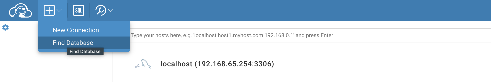

#  Code, Learn & Practice(Docker: Instalación de MariaDB y Cliente de Base de Datos en Docker)

## Objetivo

En este ejercicio, aprenderás a instalar y configurar una `base de datos MariaDB` dentro de un contenedor docker, junto con un `cliente de base de datos` para interactuar con ella. Además, se explicarán cada uno de los pasos y parámetros utilizados en los comandos.


Consulta los comandos de docker en el siguiente [enlace](https://github.com/jpexposito/code-learn/blob/main/comun/docker/COMANDOS.md).

> Recuerda que debes de tener el contenedor docker corriendo

```bash
docker -version
docker ps
```

---

## **Descargar e iniciar un contenedor MariaDB**

Ejecuta el siguiente comando para descargar la imagen oficial de MariaDB y crear un contenedor:

```bash
docker run --name mariadb-container -e MYSQL_ROOT_PASSWORD=admin -e MYSQL_DATABASE=exampledb -p 3306:3306 -d mariadb:latest
```

Que supone realiza el comando:
- `docker run`: Crea y ejecuta un contenedor.
- `--name mariadb-container`: Asigna un nombre al contenedor, en este caso, mariadb-container.
- `-e MYSQL_ROOT_PASSWORD=admin`: Establece la contraseña para el usuario root.
- `-e MYSQL_DATABASE=exampledb`: Crea una base de datos inicial llamada exampledb.
- `-p 3306:3306`: Expone el puerto 3306 del contenedor al puerto 3306 del host (puerto estándar de MySQL/MariaDB).
- `-d`: Ejecuta el contenedor en segundo plano (modo "detached").
- `mariadb:latest`: Especifica la imagen de MariaDB que se usará, en este caso, la última versión disponible (latest).

```bash
Unable to find image 'mariadb:latest' locally
latest: Pulling from library/mariadb
afad30e59d72: Already exists 
b798007f0f2e: Pull complete 
6848f7678a48: Pull complete 
09caa4361361: Pull complete 
edd0b513c29e: Pull complete 
823030c1f43b: Pull complete 
188db50456bf: Pull complete 
69a30bc484d7: Pull complete 
```

### **Verificar que el contenedor esté corriendo**  

Ejecuta el siguiente comando para listar los contenedores en ejecución:

```bash
docker ps
```

Si quieres ver todos los contenedores, tanto los que están activos como los detenidos:

```bash
docker ps -a
```

>Debes de obtener una salida similar a:

```bash
CONTAINER ID   IMAGE                                 COMMAND                  CREATED          STATUS                      PORTS                    NAMES
80fea60681a7   mariadb:latest                        "docker-entrypoint.s…"   47 seconds ago   Up 46 seconds               0.0.0.0:3306->3306/tcp   mariadb-container
```

> **-a**: Lista todos los contenedores, incluso los que no están en ejecución.
>**Importante**: *Resulta importante conocer en todo momento los contenedor que tenemos instalados en la máquina anfitriona*.

### **Verificar logs en caso de problemas**

Si la aplicación de ejemplo tampoco funciona, revisa los logs de Tomcat para detectar posibles errores:

```bash
docker logs -f <nombre_contenedor>
```

Busca cualquier mensaje relacionado con el despliegue o errores en la configuración.

### **Utiliza docker inspect**

 Puedas o no acceder, intenta usar la IP del contenedor Docker (que puedes obtener con docker inspect).

```code
docker inspect <nombre_contenedor>
```

---

### **Descargar un cliente de base de datos para MariaDB (Adminer)**

En primer lugar debemos de encontrar un cliente de bbdd que este en docker. Uno de ellos, con una buena interfaz gráfica es `CloudBeaver`.


Vamos a realizar los pasos para configurarar CloudBeaver, una versión web de DBeaver Community, para gestionar bases de datos MariaDB utilizando Docker.

---

### **Descargar y ejecutar CloudBeaver en Docker**

Ejecuta el siguiente comando para iniciar un contenedor de CloudBeaver:

```bash
docker run -d --name cloudbeaver -p 8978:8978 dbeaver/cloudbeaver:latest
```

- `docker run`: Crea y ejecuta un nuevo contenedor.
- `-d`: Ejecuta el contenedor en segundo plano.
- `--name cloudbeaver`: Asigna el nombre cloudbeaver al contenedor.
- `-p 8978:8978`: Mapea el **puerto 8978** del contenedor (puerto de CloudBeaver) al **puerto 8978** en tu máquina host. ***El puerto debe o puede estar ocupado por otra herramienta***.
- `dbeaver/cloudbeaver:latest`: Usa la imagen oficial de CloudBeaver, siempre actualizada a la última versión disponible.

```bash
docker ps -a
```

> Debes de obtener una salida similar a:

```bash
CONTAINER ID   IMAGE                                 COMMAND                  CREATED          STATUS                      PORTS                    NAMES
53fdfab55937   dbeaver/cloudbeaver:latest            "./run-server.sh"        38 seconds ago   Up 37 seconds               0.0.0.0:8978->8978/tcp   cloudbeaver
```

---

### **Acceder a la interfaz de CloudBeaver**

- Abre un navegador web.
- Navega a la dirección `http://localhost:8978`.
- Sigue las instrucciones de configuración inicial.

Realiza la configuración del cliente:


---

### Encontrar la BBDD

`CloudBeaver` permite encontrar las BBDD que esten dentro de su red.



- `+` -> `Find DataBase`. 
- En el buscador escribe `localhost`.

>**Importante**: *Debes de obtener una respuesta similar a la que se visualiza en la imagen*. Copia la `ip` que se encuentra asociada a `localhost`.

---

### **Conectar CloudBeaver a MariaDB**

- Desde la interfaz de CloudBeaver, selecciona `New Connection (Nueva conexión)`.
- Selecciona `MariaDB/MySQL` como tipo de base de datos.
- Introduce los datos de conexión:
 Host: `ip` -> `192.168....`.
- Puerto: `3306` *(el puerto configurado para MariaDB)*.
- Usuario: `root` *(u otro usuario configurado)*.
- Contraseña: `admin` *(o la contraseña configurada para el usuario)*.
- Base de datos: `exampledb` *(u otra base de datos que hayas configurado).


- Haz clic en `Test Connection` para verificar la conexión.


- Si la conexión es exitosa, haz clic en `Finish`.


### **Detener y eliminar contenedores**

Cuando termines de trabajar con CloudBeaver/MariaBD, puedes detener y eliminar el contenedor con los siguientes comandos:

```bash
docker stop <nombre-contenedor>
```

> Para eliminar un contenedor
>
>```bash
>docker rm <nombre-contenedor>
>```


## Licencia 📄

Este proyecto está bajo la Licencia (Apache 2.0) - mira el archivo [LICENSE.md]([../../../LICENSE.md](https://github.com/jpexposito/code-learn-practice/blob/main/LICENSE)) para detalles.
