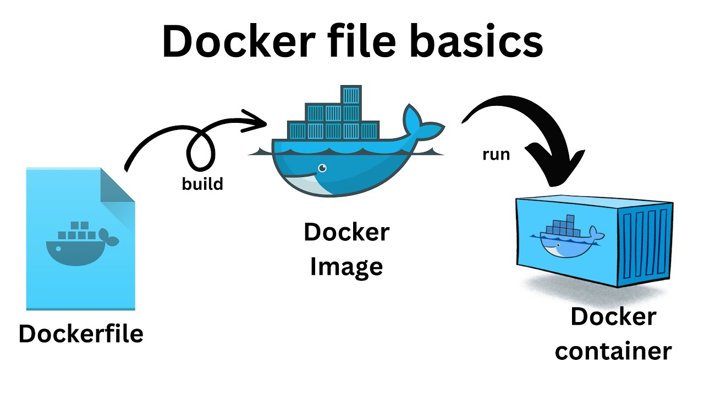

#  Code, Learn & Practice(Docker: Construcción de un Dockerfile con Tomcat, MariaDB y Cliente de Base de Datos)




Un **Dockerfile** es un archivo de texto que contiene instrucciones para automatizar la creación de imágenes de Docker. Estas imágenes se utilizan para configurar contenedores con el entorno y las aplicaciones necesarias. El Dockerfile permite personalizar el contenido de las imágenes, definiendo dependencias, configuraciones, puertos, variables de entorno y más.

---

## **Características de un Dockerfile**

### 1. **Definición Declarativa**

Un Dockerfile permite definir de forma declarativa todos los pasos necesarios para crear una imagen, desde la elección de la imagen base hasta la configuración de servicios.

### 2. **Automatización**

Permite automatizar la creación de imágenes de manera consistente, lo que elimina errores manuales y asegura que todos los entornos tengan configuraciones idénticas.

### 3. **Reproducibilidad**

El mismo Dockerfile puede usarse en diferentes entornos para construir imágenes idénticas, asegurando consistencia en el desarrollo, pruebas y producción.

### 4. **Compatibilidad**

Las imágenes creadas a partir de un Dockerfile son portables y pueden ejecutarse en cualquier máquina con Docker instalado.

### 5. **Optimización**

Docker utiliza un sistema de **caché de capas** que evita repetir pasos innecesarios al construir una imagen, lo que acelera el proceso.

---

## Instrucciones Principales en un Dockerfile

Un Dockerfile utiliza instrucciones específicas para definir cómo se construirá una imagen. A continuación, se describen las principales instrucciones utilizadas en la creación de imágenes Docker.

---

### **1. FROM**

Define la imagen base que se usará como punto de partida para construir la nueva imagen. Es obligatorio y suele ser la primera instrucción en el Dockerfile.

```dockerfile
FROM python:3.9-slim
```

---

### **2. RUN**

Ejecuta comandos durante la construcción de la imagen. Esta instrucción se utiliza comúnmente para instalar dependencias o realizar configuraciones en el sistema operativo base.

```dockerfile
RUN apt-get update && apt-get install -y curl
```

---

### **3. COPY**

Copia archivos o directorios desde la máquina anfitriona al sistema de archivos de la imagen Docker. Es útil para incluir aplicaciones, scripts o configuraciones.

```dockerfile
COPY ./app.py /usr/src/app/
```

---

### **4. CMD**

Especifica el comando que se ejecutará por defecto cuando se inicie un contenedor basado en esta imagen. Solo puede haber un `CMD` en un Dockerfile.

```dockerfile
CMD ["python", "/usr/src/app/app.py"]
```

---

### **5. ENTRYPOINT**

Configura el contenedor para que ejecute un programa o script principal. A diferencia de `CMD`, `ENTRYPOINT` puede aceptar parámetros adicionales al ejecutar el contenedor.

```dockerfile
ENTRYPOINT ["python"]
CMD ["/usr/src/app/app.py"]
```

---

### **6. ENV**

Define variables de entorno que estarán disponibles dentro del contenedor. Es útil para configurar la aplicación o servicios dentro del contenedor.

```dockerfile
ENV APP_ENV=production
```

---

### **7. EXPOSE**

Declara los puertos que se usarán en el contenedor. Esto es informativo y debe combinarse con `-p` o `--publish` al iniciar el contenedor para mapear los puertos al anfitrión.

```dockerfile
EXPOSE 8080
```

---

### **8. WORKDIR**

Establece el directorio de trabajo dentro del contenedor. Todas las instrucciones posteriores utilizarán este directorio como referencia.

```dockerfile
WORKDIR /usr/src/app
```

---

### **9. ADD**

Similar a `COPY`, pero incluye funcionalidades adicionales, como la capacidad de extraer automáticamente archivos comprimidos o descargar archivos desde una URL.

```dockerfile
ADD my-archive.tar.gz /my-folder/
```

---

## **10. ARG**

Declara variables que se pueden pasar como argumentos en el momento de la construcción de la imagen. Estas variables no estarán disponibles dentro del contenedor en tiempo de ejecución.

```dockerfile
ARG VERSION=1.0
```

---

## **11. LABEL**

Agrega metadatos a la imagen Docker, como información del autor, versión o descripciones. Es útil para documentar la imagen.

```dockerfile
LABEL maintainer="admin@example.com"
```

---

### **12. VOLUME**

Declara un punto de montaje para persistencia de datos. Los datos en un volumen sobreviven incluso si el contenedor es eliminado.

```dockerfile
VOLUME /data
```

---

### **13. ONBUILD**

Especifica instrucciones que se ejecutarán automáticamente cuando otra imagen se construya basada en esta. Es útil para crear imágenes base reutilizables.

```dockerfile
ONBUILD RUN apt-get update && apt-get install -y python3

```

---

Un pequeño ejemplo de `dockerfile` es el siguiente:

```bash
# Usar una imagen base de Python
FROM python:3.9-slim

# Establecer el directorio de trabajo dentro del contenedor
WORKDIR /app

# Copiar el archivo Python de la máquina local al contenedor
COPY app.py .

# Instalar las dependencias necesarias
RUN pip install --no-cache-dir flask

# Exponer el puerto que la aplicación utilizará
EXPOSE 5000

# Comando para ejecutar la aplicación cuando el contenedor arranca
CMD ["python", "app.py"]
```

> **Documentación oficial**:
> - [dockerfile](hhttps://docs.docker.com/reference/dockerfile/)

Consulta los comandos de docker en el siguiente [enlace](https://github.com/jpexposito/code-learn/blob/main/comun/docker/COMANDOS.md), y las redes en docker en el siguiente [enlace](https://github.com/jpexposito/code-learn/tree/main/comun/docker/ud-6).

> Recuerda que debes de tener docker corriendo

```bash
docker -version
docker ps
```

---

## Objetivo

El objetivo de este ejercicio es crear un entorno con Docker que incluya un servidor `Tomcat`, una base de datos `MariaDB` y un cliente para acceder a la base de datos. Para esto, configuraremos los contenedores con redes personalizadas y un `volumen común` para persistir datos.

---

## Requisitos

- Crear una red Docker personalizada para los contenedores.
- Crear un contenedor Tomcat para desplegar una aplicación web.
- Crear un contenedor MariaDB para gestionar la base de datos.
- Utilizar un volumen común para persistir los datos de la base de datos.

---

## Pasos

### Paso 1: Crea la red personalizada

Primero, crea una red Docker personalizada para que los contenedores puedan comunicarse entre sí.

```bash
docker network create my_network
```

>***Importante***: *Sustituye my_network por otro nombre*.

### Paso 2: Crear un volumen común

Luego, crea un volumen Docker para persistir los datos.

```bash
docker volume create my_db_volume
```

>***Importante***: *Sustituye my_db_volume por otro nombre*.

### Paso 3: Crear el Dockerfile

A continuación, creamos un Dockerfile que instalará Tomcat, MariaDB y CloudBeaver.

```bash
# Usar una imagen base de Ubuntu para las instalaciones adicionales
FROM ubuntu:20.04

# Instalar dependencias necesarias (como wget y curl)
RUN apt-get update -y && \
    apt-get install -y \
    wget \
    curl \
    unzip \
    mysql-client \
    && rm -rf /var/lib/apt/lists/*

# Configurar MariaDB usando la imagen oficial
FROM mariadb:10.5

# Configurar Tomcat usando la imagen oficial
FROM tomcat:9.0

# Descargar y configurar CloudBeaver utilizando la imagen oficial de CloudBeaver desde Docker Hub
FROM dbeaver/cloudbeaver:latest

# Exponer puertos
EXPOSE 8080 8081

# Volúmenes para MariaDB
VOLUME /var/lib/mysql

# Configuración de MariaDB: Establecer la contraseña root y crear la base de datos (esto es suficiente con las variables de entorno)
ENV MYSQL_ROOT_PASSWORD=root
ENV MYSQL_DATABASE=exampledb

# Iniciar los servicios de MariaDB, Tomcat y CloudBeaver
CMD service mysql start && \
    /opt/tomcat/bin/catalina.sh run & \
    /opt/cloudbeaver/cloudbeaver/bin/cloudbeaver & \
    wait
```

## 쯈ué estamos haciendo?

Explicación del Dockerfile:

- `Instalación de dependencias`: Se instalan los paquetes necesarios como **wget, curl, mysql-client, y unzip***.
- `Tomcat`: Se descarga e instala `Tomcat`, y se añade la aplicación de ejemplo (`sample.war`).
- `MariaDB`: Se instala `MariaDB` utilizando el script oficial.
- `CloudBeaver`: Se descarga e instala CloudBeaver, un cliente de base de datos basado en la web.
- `Volúmenes`: Se crea un volumen para persistir los datos de MariaDB en `/var/lib/mysql`.
- Comando `CMD`: El comando ejecuta `MariaDB`, luego `Tomcat` y finalmente `CloudBeaver`, para que los tres servicios estén activos y funcionen correctamente.

### Paso 4: Construir y ejecutar la imagen
Para construir la imagen desde el Dockerfile, usa el siguiente comando:

```bash
docker build -t tomcat-mariadb-cloudbeaver .
```

Lista los contenedores que tienes en tu equipo:

```bash
docker ps -a 
```

Luego, para ejecutar el contenedor que contiene Tomcat, MariaDB y CloudBeaver, usa:

```bash
docker run -d -p 8080:8080 -p 8081:8081 tomcat-mariadb-cloudbeaver
```  


### **Detener y eliminar contenedores**

Cuando termines de trabajar con CloudBeaver/MariaBD, puedes detener y eliminar el contenedor con los siguientes comandos:

```bash
docker stop <nombre-contenedor>
```

> Para eliminar un contenedor
>
>```bash
>docker rm <nombre-contenedor>
>```

---

## Licencia 📄

Este proyecto está bajo la Licencia (Apache 2.0) - mira el archivo [LICENSE.md]([../../../LICENSE.md](https://github.com/jpexposito/code-learn-practice/blob/main/LICENSE)) para detalles.
