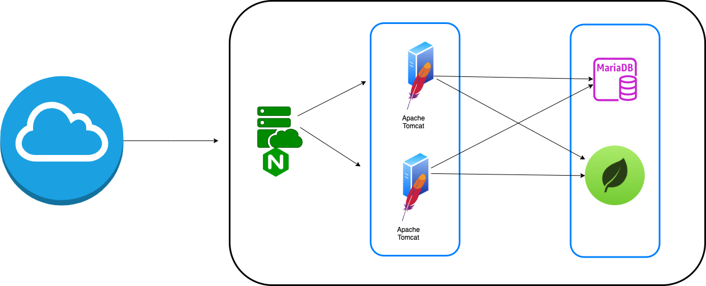

#  Code, Learn & Practice(Docker: Construcción de una solución basada en servicios)

Siguiendo la solución realizada en la [tarea anterior](../tarea-7/). Se pide construir la solución propuesta en la siguiente imagen.



---

## Objetivo

El objetivo de este ejercicio es crear un entorno con Docker que incluya dos servidores `Tomcat`, una base de datos `MariaDB` y una `bbdd no sql` y así como los clientes para acceder a ambas bases de datos. Para esto, configuraremos los contenedores con redes personalizadas y un `volumen común` para persistir datos.

---

## Requisitos

- Crear una red Docker personalizada para los contenedores.
- Crear un conjunto de contenedores Tomcat para desplegar las aplicaciones web.
- Crear un contenedor MariaDB para gestionar la base de datos.
- Crear un contenedor Mongodb para gestionar la base de datos no sql.
- Utilizar un volumen común para persistir los datos de la base de datos.

---

## Pasos

### Paso 1: Crea la red personalizada

Primero, crea una red Docker personalizada para que los contenedores puedan comunicarse entre sí.

```bash
docker network create my_network
```

>***Importante***: *Sustituye my_network por otro nombre*.

### Paso 2: Crear un volumen común

Luego, crea un volumen Docker para persistir los datos.

```bash
docker volume create my_db_volume
```

>***Importante***: *Sustituye my_db_volume por otro nombre*.

### Paso 3: Crear el Dockerfile

A continuación, creamos un Dockerfile que instalará Tomcat, MariaDB y CloudBeaver.

```bash
# Usar una imagen base de Ubuntu para las instalaciones adicionales
FROM ubuntu:20.04

# Instalar dependencias necesarias (como wget y curl)
RUN apt-get update -y && \
    apt-get install -y \
    wget \
    curl \
    unzip \
    mysql-client \
    && rm -rf /var/lib/apt/lists/*
...
```

### Paso 4: Construir y ejecutar la imagen

Para construir la imagen desde el Dockerfile, usa el siguiente comando:

```bash
docker build -t solucion-servicios .
```

Lista los contenedores que tienes en tu equipo:

```bash
docker ps -a 
```

Luego, para ejecutar el contenedor que contiene Tomcat, MariaDB,CloudBeaver, etc y usa:

```bash
docker run -d -p 8080:8080 -p ... solucion-servicios
```  

### **Detener y eliminar contenedores**

Cuando termines de trabajar, puedes detener y eliminar el contenedor con los siguientes comandos:

```bash
docker stop <nombre-contenedor>
```

> Para eliminar un contenedor
>
>```bash
>docker rm <nombre-contenedor>
>```

---

## Demuestra el funcionamiento

Demuestra el funcionamiento de los `tomcat` desplegando la aplicación `sample`. De la misma forma demuestra la conexión a las `bbdd` a conectando a través de los clientes. 

## Referencias

- [Tarea 7 (Construcción de Docker)](../tarea-7/).
- [Tarea 6 (BBDD No Relacionales)](../tarea-6/).
- [Tarea 5 (Balanceo de Carga)](../tarea-5/).

## Licencia 📄

Este proyecto está bajo la Licencia (Apache 2.0) - mira el archivo [LICENSE.md]([../../../LICENSE.md](https://github.com/jpexposito/code-learn-practice/blob/main/LICENSE)) para detalles.
