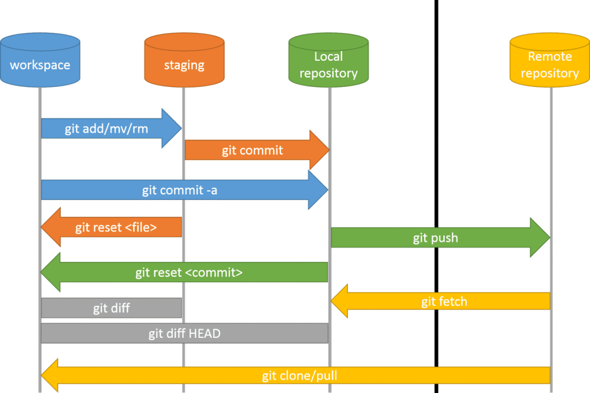

#  Code, Learn & Practice(Entornos de Desarrollo: Repasando lo que sabemos de Git")




## ¿Qué vamos a trabajar en esta tarea?

Vamos a repasar la lista de comandos que hemos visto hasta el momento, y veremos el uso de **git log y el HEAD**.

> **Incorpora el uso de git status para ver los ficheros que debes de añadir antes de realizar los git add**.

❗️Para hacer estos ejercicios es necesario crear un ***nuevo repositorio en GitHub***.
Ve a **GitHub** y ***crea un nuevo repositorio con el nombre ejercicio-git-libro***.

Inicializa el repositorio con un archivo **README.md básico con el título del proyecto**. En el guardaras cada uno de los pasos que has realizado para ***superar la tarea**.

Para comenzar debes de realizar la clonación del repositorio `https://github.com/tu-usuario/ejercicio-git-libro` mediante la siguiente secuencia de comandos:

```console
git clone https://github.com/tu-usuario/ejercicio-git-libro.git
cd ejercicio-git-libro
ls -la
```

>**Nota**: Recuerda siempre ir mostrando el contenido del directorio ejercicio-git-libro a través del comando **ls -la**.

## Ejercicio 1

- Mostrar el [historial de cambios del repositorio](https://github.com/jpexposito/code-learn/blob/main/comun/git/COMANDOS.md#git-log), a través del comando **log,tanto a través de linea de comandos como modo gráfico**, sigue las instrucciones del comando.
- Crear la **carpeta capítulos** y crear dentro de ella el fichero **capitulo1.txt** con el siguiente texto.
  
  ```console
  Git es un sistema de control de versiones ideado por Linus Torvalds.
  ```

- Añadir los cambios a la zona de intercambio temporal(**git add**).
- Hacer un **commit** de los cambios con el mensaje *Añadido capítulo 1.*
- Volver a mostrar el historial de cambios del repositorio(**git log con las opciones**).

<details>
  <summary>PULSA PARA VER LA SOLUCIÓN:</summary>

 ```console
 git log
 mkdir capitulos
 cat > capitulos/capitulo1.txt
 Git es un sistema de control de versiones ideado por Linus Torvalds.
 ```

>**Nota**: **Ctrl+D** nos permite salir del cat.

> ** También puedes trabajar con VSCODE** para la creación y manipulación de carpetas y ficheros**.

```console
 git add .
 git commit -m "Añadido capítulo 1."
 git log
 ```

 >**Nota**: **git add** permite añadir elementos al especio de intercambio.
 **git log** permite ver el historico de cambios.

</details>

## Ejercicio 2

- Crear el fichero **capitulo2.txt** en la carpeta capítulos con el siguiente texto.

```console
El flujo de trabajo básico con Git consiste en:
 1- Hacer cambios en el repositorio.
 2- Añadir los cambios a la zona de intercambio temporal.
 3- Hacer un commit de los cambios.
```

- Añadir los cambios a la zona de intercambio temporal.(**git** *que comando tengo que añadir*).
- Hacer un commit de los cambios con el mensaje *Añadido capítulo 2.*
- Mostrar las diferencias entre la última versión y dos versiones anteriores.
(**git** *que comando tengo que añadir*).

<details>
  <summary>PULSA PARA VER LA SOLUCIÓN:</summary>

```console
 cat > capitulos/capitulo2.txt
 El flujo de trabajo básico con Git consiste en:
 1- Hacer cambios en el repositorio.
 2- Añadir los cambios a la zona de intercambio temporal.
 3- Hacer un commit de los cambios.
 ```

 >**Nota**:**Ctrl+D**, sale del cat.

 ```code
 git add .
 git commit -m "Añadido capítulo 2."
 git diff HEAD~2..HEAD
```

>**Nota**: **HEAD** Apunta al último cambio del repositorio.

</details>

## Ejercicio 3

- Crear el fichero capitulo3.txt en la carpeta capítulos con el siguiente texto.

```console
Git permite la creación de ramas lo que permite tener distintas versiones del mismo proyecto y trabajar de manera simultanea en ellas.
```

- Añadir los cambios a la zona de intercambio temporal.
- Hacer un commit de los cambios con el mensaje *Añadido capítulo 3.*
- Mostrar las diferencias entre la primera y la última versión del repositorio.

<details>
  <summary>PULSA PARA VER LA SOLUCIÓN:</summary>

```console
 > cat > capitulos/capitulo3.txt
 Git permite la creación de ramas lo que permite tener distintas versiones del mismo proyecto y trabajar de manera simultanea en ellas.
 ```

*Ctrl+D* **recuerdas lo que hacia?**.

```console
git add .
git commit -m "Añadido capítulo 3."
git log
 git diff <codigo hash de la primera version>..HEAD
```

</details>

## Ejercicio 4

- Crea el fichero índice.txt la siguiente línea:

```console
Indice de los cápitulos, con conceptos avanzados de git
```

- Añadir los cambios a la zona de intercambio temporal.
- Hacer un commit de los cambios con el mensaje *"Indice de los cápitulos, con conceptos avanzados de git*.
- Mostrar quién ha hecho cambios sobre el fichero *indice.txt*.

<details>
  <summary>PULSA PARA VER LA SOLUCIÓN:</summary>

```console
 cat > indice.txt
 git add .
 git commit -m "Se crea el indice."
 echo "Indice de los cápitulos, con conceptos avanzados de git" >> indice.txt
 git add .
 git commit -m "Añadido el índice ."
 git annotate indice.txt
 ```

</details>

## Ejercicio 5

Crear una nueva rama bibliografía y mostrar las ramas del repositorio.

>**Nota**: Recuerda que **git branch** crea una rama.

<details>
  <summary>PULSA PARA VER LA SOLUCIÓN:</summary>

```console
  git branch bibliografia
  git branch -av
```

</details>


## Ejercicio 6

- Crear el fichero capitulos/capitulo4.txt y añadir el texto siguiente:

```console
  En este capítulo veremos cómo usar GitHub para alojar repositorios en remoto.
```

- Añadir los cambios a la zona de intercambio temporal.
- Hacer un commit con el mensaje “Añadido capítulo 4.”
- Mostrar la historia del repositorio incluyendo todas las ramas.

<details>
 <summary>PULSA PARA VER LA SOLUCIÓN:</summary>

```console
cat > capitulos/capitulo4.txt
En este capítulo veremos cómo usar GitHub para alojar repositorios en remoto.
```

Ctrl+D

```console
git add .
git commit -m "Añadido capítulo 4."
git log --graph --all --oneline
```

>**Nota**: Observa la salida del comando **git log --graph --all --oneline**.

</details>

## Ejercicio 7

- Cambiar a la rama bibliografía.
- Crear el fichero bibliografia.txt y añadir la siguiente referencia:

```console
Chacon, S. and Straub, B. Pro Git. Apress.
```

- Añadir los cambios a la zona de intercambio temporal.
- Hacer un commit con el mensaje “Añadida primera referencia bibliográfica.”
- Mostrar la historia del repositorio incluyendo todas las ramas.

<details>
  <summary>PULSA PARA VER LA SOLUCIÓN:</summary>

```console
 git checkout bibliografia
 cat > bibliografia.txt
 - Chacon, S. and Straub, B. Pro Git. Apress.
 ```

**Ctrl+D**

```console
git add .
git commit -m "Añadida primera referencia bibliográfica."
git log --graph --all --oneline
```

</details>

## Ejercicio 8

- Fusionar la rama bibliografía con la rama main.
- Mostrar la historia del repositorio incluyendo todas las ramas.
- Eliminar la rama bibliografía.
- Mostrar de nuevo la historia del repositorio incluyendo todas las ramas.

>**Nota**: **git checkout** Descarga/cambia de rama.


<details>
  <summary>PULSA PARA VER LA SOLUCIÓN:</summary>

 ```console
  git checkout main
  git merge bibliografia
  git log --graph --all --oneline
  git branch -d bibliografia
  git log --graph --all --oneline
 ```

 </details>

## Ejercicio 9
- Crear la rama bibliografía.
- Cambiar a la rama bibliografía.
- Cambiar el fichero bibliografia.txt para que contenga las siguientes referencias:

```cosole
Scott Chacon and Ben Straub. Pro Git. Apress.
Ryan Hodson. Ry’s Git Tutorial. Smashwords (2014)
```

- Cambiar a la rama main.
- Cambiar el fichero bibliografia.txt para que  - contenga las siguientes referencias:

```console
Chacon, S. and Straub, B. Pro Git. Apress.
Loeliger, J. and McCullough, M. Version control with Git. O’Reilly.
```

- Añadir los cambios a la zona de intercambio temporal y hacer un commit con el mensaje “Añadida nueva referencia bibliográfica.”
- Fusionar la rama bibliografía con la rama main.
- Resolver el conflicto dejando el fichero bibliografia.txt con las referencias:

```console
Chacon, S. and Straub, B. Pro Git. Apress.
Loeliger, J. and McCullough, M. Version control with Git. O’Reilly.
Hodson, R. Ry’s Git Tutorial. Smashwords (2014)
```

- Añadir los cambios a la zona de intercambio temporal y hacer un commit con el mensaje “Resuelto conflicto de bibliografía.”
- Mostrar la historia del repositorio incluyendo todas las ramas.

<details>
  <summary>PULSA PARA VER LA SOLUCIÓN:</summary>

 ```console
 git branch bibliografia
 git checkout bibliografia
 cat > bibliografia.txt
 - Scott Chacon and Ben Straub. Pro Git. Apress.
 - Ryan Hodson. Ry's Git Tutorial. Smashwords (2014)
 ```

 >**Nota**:**Ctrl+D** salimos del cat.

 ```console
 git commit -a -m "Añadida nueva referencia bibliográfica."
 git checkout main
 cat > bibliografia.txt
 - Chacon, S. and Straub, B. Pro Git. Apress.
 - Loeliger, J. and McCullough, M. Version control with Git. O'Reilly.
 ```

 >**Nota**:**Ctrl+D** salimos del cat.

```console
 git commit -a -m "Añadida nueva referencia bibliográfica."
 git merge bibliografia
 git nano bibliografia
 # Hacer los cambios indicados en el fichero
 git commit -a -m "Solucionado conflicto bibliografía."
 git log --graph --all --oneline
 ```

## Licencia 📄

Este proyecto está bajo la Licencia (Apache 2.0) - mira el archivo [LICENSE.md]([../../../LICENSE.md](https://github.com/jpexposito/code-learn-practice/blob/main/LICENSE)) para detalles.
