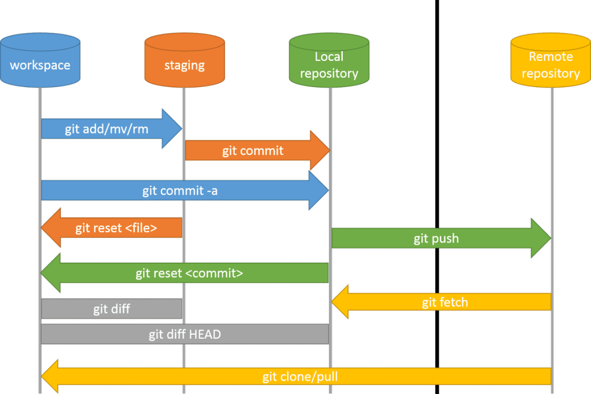

#  Code, Learn & Practice(Entornos de Desarrollo: Avanzando en Git "Creando tags (etiquetas)")



En esta tarea vamos a continuar con de Git, aplicando comandos que son útiles en situaciones más avanzadas como el uso de etiquetas (`tags`), `revertir commits`, `cherry-picking`, y la comparación entre ramas.

---

## ¿Qué vamos a trabajar en esta tarea?

Veremos cómo trabajar con **etiquetas** para marcar versiones importantes del proyecto, cómo **revertir cambios** de commits específicos, cómo aplicar commits de una rama en otra con **cherry-pick**, y cómo hacer comparaciones entre ramas. Además, profundizaremos en los **conflictos de fusión**.

## Pre-requisitos

Antes de comenzar, asegúrate de haber realizado las siguientes acciones:

1. Tener el repositorio `ejercicio-git-libro` clonado en tu máquina local.
2. Haber seguido los ejercicios anteriores de control de versiones, ramas y commits.

---

## Ejercicio 1: Etiquetar una versión

1. Crea una nueva etiqueta en la rama principal que marque el estado actual del repositorio como la **versión 1.0**.
2. Empuja la etiqueta al repositorio remoto.

   > **Pista:** Usa `git tag` para crear una etiqueta y `git push origin --tags` para enviarla al repositorio remoto.

3. Muestra la lista de etiquetas presentes en el repositorio usando `git tag`.

---

## Ejercicio 2: Revertir un commit

1. Haz un cambio sencillo en uno de los archivos (puedes agregar una línea de texto en el archivo `capitulo1.txt`), y realiza un **commit** con un mensaje apropiado, como *"Agregada una línea en capítulo 1"*.

2. Imagina que te has equivocado y no querías hacer ese cambio. Reviértelo usando `git revert`.

3. Muestra el historial de commits para verificar que el commit de reversión se ha realizado correctamente.

---

## Ejercicio 3: Aplicar cambios de otra rama con Cherry-pick

1. Crea una **nueva rama** llamada `nueva-funcionalidad` y haz un cambio en la rama, por ejemplo, crea un nuevo archivo `capitulo5.txt` con el siguiente contenido:

    ```bash
    En este capítulo veremos cómo gestionar múltiples ramas en Git.
    ```

2. Realiza un **commit** del cambio.

3. Vuelve a la rama `main` y usa `git cherry-pick` para aplicar el commit de la rama `nueva-funcionalidad` en `main`.

   > **Pista:** Usa `git cherry-pick <hash-commit>` para aplicar el commit.

4. Muestra el historial de la rama `main` para comprobar que el commit ha sido agregado.

---

## Ejercicio 4: Comparar ramas

1. Haz un cambio en la rama `main` (puedes modificar el archivo `README.md` agregando una breve descripción).

2. Usa el comando `git diff` para comparar los cambios entre la rama `main` y la rama `nueva-funcionalidad`.

3. Documenta las diferencias encontradas.

---

## Ejercicio 5: Resolver conflictos de fusión

1. Crea un **conflicto de fusión** modificando el mismo archivo en ambas ramas (`main` y `nueva-funcionalidad`). 
   - Por ejemplo, edita el archivo `capitulo2.txt` en ambas ramas con contenido diferente.

2. Intenta hacer un **merge** de la rama `nueva-funcionalidad` en `main` y resuelve el conflicto manualmente.

3. Realiza un commit una vez resuelto el conflicto, y muestra la historia del repositorio.

---

## Ejercicio 6: Revertir un merge

1. Realiza un **merge** de la rama `nueva-funcionalidad` en la rama `main`.

2. Ahora, imagina que no querías hacer esa fusión. Usa `git revert` para revertir el merge.

   > **Pista:** Revertir un merge requiere utilizar el flag `-m` para especificar qué padre del merge debe considerarse.

---

## Ejercicio 7: Eliminar una etiqueta

1. Borra la etiqueta **v1.0** localmente y en el repositorio remoto.

   > **Pista:** Usa `git tag -d` para borrar la etiqueta localmente y `git push origin :refs/tags/<nombre-tag>` para eliminarla del remoto.

---

## Ejercicio 8: Restablecer un commit (Reset)

1. Haz un commit en la rama `main` y luego restablece el estado del repositorio al commit anterior utilizando `git reset --hard`.

2. Verifica el estado del repositorio después del reset.

---

## Conclusión

En esta tarea has aprendido a trabajar con etiquetas para marcar versiones importantes, a revertir cambios y fusiones, a aplicar commits seleccionados entre ramas, y a resolver conflictos de fusión. Estos comandos son esenciales para gestionar un proyecto en Git de manera eficaz.

Recuerda ir documentando los pasos que has seguido y los comandos que has utilizado en el archivo `README.md` del repositorio.

---

## Licencia 📄

Este proyecto está bajo la Licencia (Apache 2.0) - mira el archivo [LICENSE.md]([../../../LICENSE.md](https://github.com/jpexposito/code-learn-practice/blob/main/LICENSE)) para detalles.
