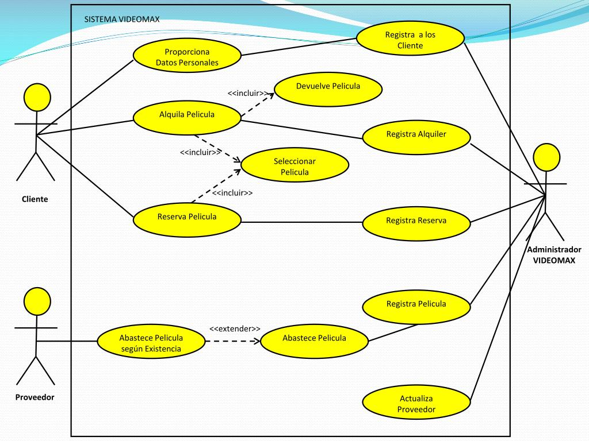

#  Code, Learn & Practice(Simulacro I-> Diagrama de Casos de Uso)

## Ejercicio 1 Tienda de Comercio Electrónico

Una tienda en línea necesita un sistema que permita a los clientes comprar productos a través de un sitio web.

Como parte de los requisitos funcionales, el sistema debe incluir los siguientes procesos:

1. El cliente puede **navegar por el catálogo** para visualizar los productos disponibles.
2. Una vez que el cliente selecciona un producto, tiene la opción de **colocar el artículo en el carrito**.
3. Para completar la compra, el cliente debe realizar las siguientes acciones:
   - **Informar su dirección de envío** (extensión opcional si ya tiene una dirección registrada).
   - **Completar los datos de su tarjeta de crédito** para el pago.
4. Durante la transacción, el sistema debe:
   - **Verificar los datos de la tarjeta de crédito** del cliente.
   - **Facturar la compra** exitosamente.
   - **Enviar un e-mail de confirmación** con los detalles de la compra al cliente.

El sistema también debe mostrar qué partes de este flujo son obligatorias y cuáles son opcionales. A partir de los requerimientos indicados:

Diseña un diagrama de casos de uso que represente las interacciones entre el cliente, el sistema y los `casos de uso necesarios`y los `actores implicados` para realizar una compra. Usa relaciones como `<<include>>` y `<<extend>>` según corresponda.

<details>
  <summary>SOLUCIÓN:</summary>
  
```code

```

</details>  


## Ejercicio 2: Realiza la especificación de Casos de Uso

Realiza la especificación de casos de uso de la siguiente imagen.



---

## Licencia 📄

Este proyecto está bajo la Licencia (Apache 2.0) - mira el archivo [LICENSE.md]([../../../LICENSE.md](https://github.com/jpexposito/code-learn-practice/blob/main/LICENSE)) para detalles.
