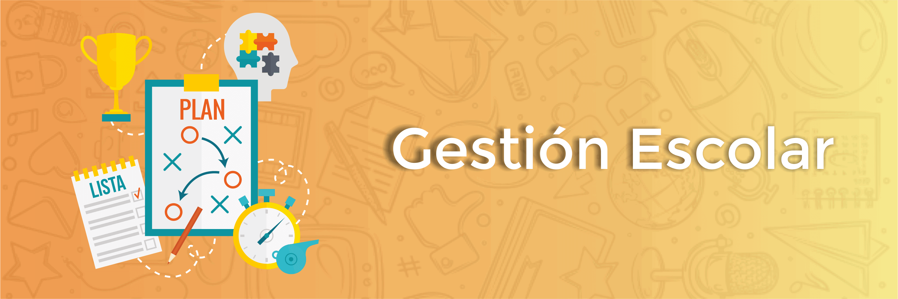

#  Code, Learn & Practice(Entornos de Desarrollo: Diagramas de Clases ")

## 

### Descripción

En una escuela, las **Personas** son un elemento fundamental. Cada persona tiene un **nombre** y una **edad**, y todas pueden realizar una acción común: **saludar**, donde simplemente dicen su nombre y edad. Entre las personas, hay dos tipos principales: **Estudiantes** y **Profesores**.

Un **Estudiante** hereda las propiedades básicas de una persona, pero además tiene una **matrícula** única que lo identifica. Los estudiantes pueden realizar la acción de **estudiar**, lo que indica que están avanzando en sus aprendizajes.

Por otro lado, un **Profesor** también es una persona, pero tiene una **especialidad**, que indica el área que enseña. Los profesores pueden realizar la acción de **enseñar**, donde muestran qué materia están impartiendo.

La escuela organiza sus contenidos en **Cursos**, cada uno con un **nombre** y un **código** único. Un curso puede **agregar estudiantes**, manteniendo un registro de los inscritos, y puede **listar estudiantes** para mostrar quiénes están participando.

Cada curso está relacionado con una **Materia**, que también tiene un **nombre** y un **código**. Las materias permiten acceder a sus **detalles**, como el nombre y el código asociados.

Además, la escuela organiza **Exámenes**, cada uno asociado a una materia específica. Un examen tiene una **fecha** en la que se realiza y puede **programarse**, lo que establece o actualiza su fecha y materia asociada.

Para apoyar el aprendizaje, la escuela cuenta con una **Biblioteca**. Cada biblioteca tiene un **nombre** y puede **registrar libros** para incluirlos en su inventario. También puede **listar libros** disponibles para que los estudiantes puedan consultarlos.

Por último, están los **Libros**, que son recursos clave en la biblioteca. Cada libro tiene un **título** y un **autor**. Los libros tienen un método llamado **detalles**, que muestra el título y autor para referencia.

> ***Con toda la información aportada realiza los diagrama de clases y la implementación de las mismas***

## Referencias

- [Ejemplo de Diagrama de Clases](https://github.com/jpexposito/code-learn/blob/main/primero/ets/unidades/unidad-4/DIAGRAMA-CLASES-EXPLICADO.md).

---

## Licencia 📄

Este proyecto está bajo la Licencia (Apache 2.0) - mira el archivo [LICENSE.md]([../../../LICENSE.md](https://github.com/jpexposito/code-learn-practice/blob/main/LICENSE)) para detalles.
