#  Code, Learn & Practice(Entornos de Desarrollo: Comenzando con los diagramas de Secuencia ")

## **Descripción**

En este ejercicio, modelaremos un diagrama de secuencia para un sistema que permite realizar operaciones CRUD (Crear, Leer, Actualizar y Eliminar) sobre archivos en un sistema de almacenamiento.

---

## **Paso 1: Identificar los Actores y Objetos**

En un diagrama de secuencia, los actores y objetos representan a los participantes en la interacción. En este caso, tenemos:

- **Usuario** (Actor): Persona que interactúa con el sistema.
- **Sistema de Gestión de Archivos** (Objeto): Componente principal que maneja las operaciones de archivos.
- **Fichero** (Objeto): Representa el archivo que será manipulado.

---

## **Paso 2: Definir los Mensajes y Operaciones**

Las operaciones que nuestro sistema debe soportar son:

1. **Crear un archivo**
2. **Leer un archivo**
3. **Actualizar un archivo**
4. **Eliminar un archivo**

A continuación, desglosamos las interacciones para cada operación:

### **1. Crear un Archivo**

- El usuario envía una solicitud de creación al **Sistema de Gestión de Archivos**.
- El sistema crea un nuevo **Fichero** y devuelve una confirmación.

### **2. Leer un Archivo**

- El usuario solicita la lectura de un archivo existente.
- El **Sistema de Gestión de Archivos** busca el **Fichero** y devuelve su contenido.

### **3. Actualizar un Archivo**

- El usuario solicita modificar un archivo.
- El **Sistema de Gestión de Archivos** localiza el **Fichero**, lo modifica y guarda los cambios.

### **4. Eliminar un Archivo**

- El usuario solicita eliminar un archivo.
- El **Sistema de Gestión de Archivos** borra el **Fichero** y devuelve una confirmación.

---

```mermaid
sequenceDiagram
    actor Usuario
    participant "Sistema de Gestión de Archivos" as Sistema
    participant "Fichero" as Fichero

    %% Crear Archivo
    Usuario->>Sistema: CrearArchivo("datos.txt")
    Sistema->>Fichero: nuevo("datos.txt")
    Fichero-->>Sistema: Confirmación
    Sistema-->>Usuario: Archivo creado con éxito

    %% Leer Archivo
    Usuario->>Sistema: LeerArchivo("datos.txt")
    Sistema->>Fichero: abrir("datos.txt")
    Fichero-->>Sistema: contenido
    Sistema-->>Usuario: Devolver contenido

    %% Actualizar Archivo
    Usuario->>Sistema: ActualizarArchivo("datos.txt", nuevoContenido)
    Sistema->>Fichero: modificar("datos.txt", nuevoContenido)
    Fichero-->>Sistema: Confirmación
    Sistema-->>Usuario: Archivo actualizado

    %% Eliminar Archivo
    Usuario->>Sistema: EliminarArchivo("datos.txt")
    Sistema->>Fichero: borrar("datos.txt")
    Fichero-->>Sistema: Confirmación
    Sistema-->>Usuario: Archivo eliminado

```

## Licencia 📄 

Este proyecto está bajo la Licencia (Apache 2.0) - mira el archivo [LICENSE.md]([../../../LICENSE.md](https://github.com/jpexposito/code-learn-practice/blob/main/LICENSE)) para detalles.
