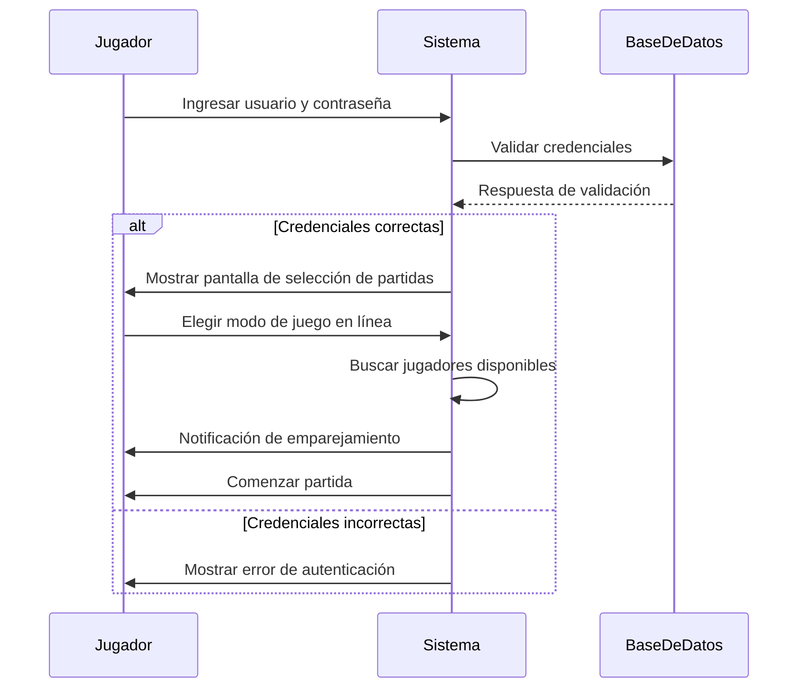

#  Code, Learn & Practice(Entornos de Desarrollo: Diagrama de Secuencia - Sistema de Videojuegos en Línea")

## **Contexto:**  
Eres parte del equipo de desarrollo de una plataforma de videojuegos en línea. Se está diseñando un sistema de **inicio de sesión y emparejamiento de jugadores** para partidas en línea.  

## **Objetivo:**  
Dibuja un **diagrama de secuencia** que represente el siguiente flujo de interacción entre un jugador y el sistema:  

1. El jugador ingresa su nombre de usuario y contraseña.  
2. El sistema valida las credenciales con la base de datos.  
3. Si las credenciales son correctas, el sistema muestra la pantalla de selección de partidas.  
4. El jugador elige una opción de juego en línea.  
5. El sistema busca jugadores disponibles y los empareja.  
6. Cuando se encuentra un grupo adecuado, el sistema notifica al jugador y comienza la partida.  
 

      
PULSA PARA VER LA SOLUCIÓN

## Licencia 📄

Este proyecto está bajo la Licencia (Apache 2.0) - mira el archivo [LICENSE.md]([../../../LICENSE.md](https://github.com/jpexposito/code-learn-practice/blob/main/LICENSE)) para detalles.
