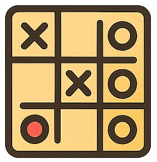
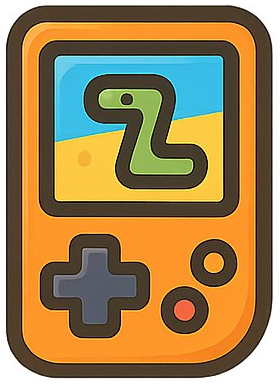
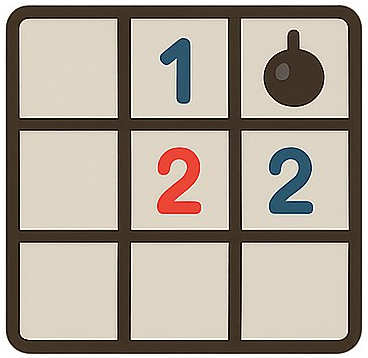

#  Code, Learn & Practice-Jugando se aprende `(Interfaces gráficas/ ficheros y bases de datos 🎯)`

## Objetivo

Demostrar habilidades de programación implementando **uno** de los 5 juegos propuestos, aplicando:

- Lógica de juego.
- Estructuras de datos.
- Persistencia en base de datos.
- Autenticación de usuarios.
- Sistema de puntuación.
  - Puntos base por partida completada
  - Bonus por rendimiento (ej: tiempo, precisión)
  - Multiplicadores por rachas de victoria
  - **Fórmula ejemplo**:
  
     ```java
     puntosTotales = (puntosBase * dificultad) + (bonusTiempo) - (penalizaciones)
     ```

## 🛠 Requisitos Generales

### Tecnológicos

- **Lenguaje**: **Java** y **JAVAFX**.
- **Control de versiones**: Git con repositorio en GitHub.
- **Base de datos**: Persistencia de datos (**SQLite**).

### Documentación (README.md)

- Logo del proyecto
- Descripción general del juego
- Captura de pantalla inicial
- **Tecnologías utilizadas** (con logos y descripción)
  - Lenguaje de programación
  - Base de datos
  - Frameworks/librerías
- Requisitos del sistema
- Información adicional:
  - Mejoras planeadas
  - Desafíos técnicos
  - Lecciones aprendidas

### Sistema de Usuarios

- Registro y autenticación
- Recuperación de contraseña vía email
- Perfiles de jugador

## 🎮 Juegos Disponibles

### 1.  **Memorama** 

**Características únicas**:

- Tablero NxN con cartas mezcladas
- Mecánica de pares coincidentes
- Sistema de dificultad escalable

### 2.  **Tres en Raya**  

**Características únicas**:

- IA con algoritmo Minimax
- Sistema de turnos alternados
- Detección de patrones ganadores

### 3.  **Quiz Interactivo**  


**Características únicas**:

- Banco de preguntas (JSON/BD)
- Temporizador por pregunta
- Sistema de puntuación dinámico

### 4.  **Snake Clásico**

**Características únicas**:

- Control por teclado
- Crecimiento progresivo
- Sistema de colisiones

### 5.  **Buscaminas**  

**Características únicas**:

- Generación procedural de mapas
- Sistema de marcación de minas
- Algoritmo de revelación de celdas

## 📊 Criterios de Evaluación

| Categoría          | Peso | Detalles |
|--------------------|------|----------|
| **Funcionalidad**  | 35%  | Juego completo sin bugs críticos |
| **Lógica**         | 25%  | Código limpio, documentado y con arquitectura MVC |
| **Base de Datos**  | 30%  | Persistencia correcta y eficiente |
| **Creatividad**    | 10%  | Valor agregado e innovación |

## 🚀 Entregables

1. **Repositorio GitHub** con:
   - Código fuente completo
   - Documentación técnica
   - Scripts de base de datos

2. **Sistema funcionando** con:
   - Autenticación de usuarios
   - Persistencia de datos
   - Todas las mecánicas básicas implementadas

3. **README** que incluya:

   - Descripción del juego.
   - Logo de la solución.
   - Guía de instalación.
   - Tecnologías.
   - Manual de usuario.
   - Pantalla inicial.

## 💡 Recomendaciones

1. **Metodología**:

   - Usar issues de GitHub para gestión de tareas

2. **Patrones de diseño**:

   - MVC para separación de concerns
   - Repository pattern para acceso a datos
   - Observer para eventos del juego

3. **Ejemplo de diseño**:


## Licencia 📄

Este proyecto está bajo la Licencia (Apache 2.0) - mira el archivo [LICENSE.md]([../../../LICENSE.md](https://github.com/jpexposito/code-learn-practice/blob/main/LICENSE)) para detalles.
